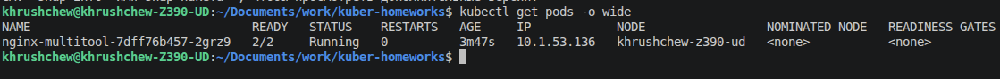
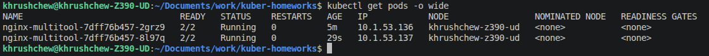
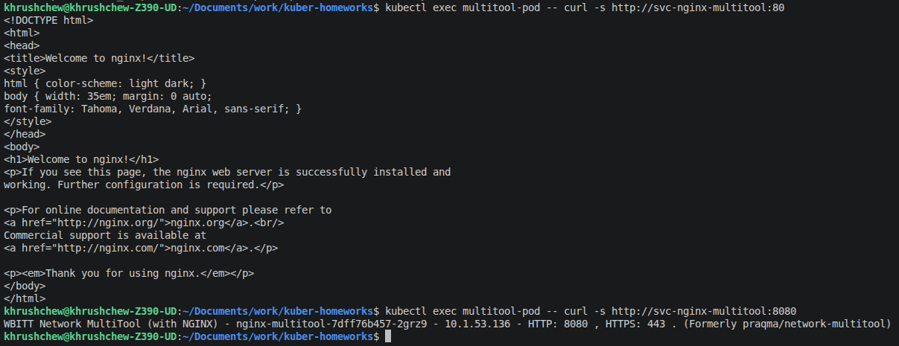
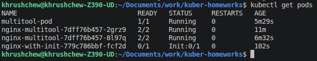
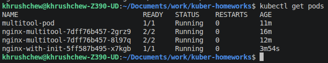

# Домашнее задание к занятию «Запуск приложений в K8S»

---

## Задание 1. Создать Deployment и обеспечить доступ к репликам приложения из другого Pod

### 1. Deployment с nginx и multitool

Создан Deployment [`deployment-nginx-multitool.yaml`](deployment-nginx-multitool.yaml) с двумя контейнерами:
- `nginx:1.25` — слушает порт **80**
- `wbitt/network-multitool` — слушает порт **8080** (порт переопределён через `HTTP_PORT`, чтобы избежать конфликта с nginx на 80)

### 2–3. Масштабирование до 2 реплик

После запуска Deployment масштабирован командой:
```bash
kubectl scale deployment nginx-multitool --replicas=2
```

**До масштабирования — 1 под:**



**После масштабирования — 2 пода:**



### 4. Service для доступа к репликам

Создан Service [`svc-nginx-multitool.yaml`](svc-nginx-multitool.yaml), который проксирует трафик на оба порта (80 и 8080) всех реплик Deployment.

### 5. Отдельный Pod с multitool и проверка curl

Создан Pod [`pod-multitool.yaml`](pod-multitool.yaml). Проверка доступа до реплик через Service:

```bash
kubectl exec multitool-pod -- curl -s http://svc-nginx-multitool:80
kubectl exec multitool-pod -- curl -s http://svc-nginx-multitool:8080
```



Ответ от nginx (порт 80): `Welcome to nginx!`  
Ответ от multitool (порт 8080): `WBITT Network MultiTool - nginx-multitool-... - HTTP: 8080`

---

## Задание 2. Deployment с Init-контейнером

### 1–2. Deployment nginx с Init-контейнером busybox

Создан Deployment [`deployment-nginx-init.yaml`](deployment-nginx-init.yaml). Init-контейнер на базе `busybox` ожидает появления сервиса `svc-nginx-init` через `nslookup`:

```bash
until nslookup svc-nginx-init.default.svc.cluster.local; do
  echo "Waiting for svc-nginx-init...";
  sleep 2;
done
```

**Пока сервис не создан — pod завис в `Init:0/1`:**



### 3–4. Создание Service и запуск nginx

После создания Service [`svc-nginx-init.yaml`](svc-nginx-init.yaml) Init-контейнер завершился успешно и nginx стартовал:

**После создания сервиса — pod перешёл в `Running`:**


